# Test 26 — انتخاب تصویرهای پیشنهادی

**۲۷ نامزد تصویری در ۹ جایگاه**، هر جایگاه سه گزینه دارد. شماره‌ها روی پیش‌نمایش‌ها و در شناسه فایل‌ها آمده‌اند. برای انتخاب کافی است شناسه‌ها را بفرستید؛ مثلاً `T26-HERO-02` و `T26-BANNER-WOMEN-01`.

این شاخه فقط صف بازبینی است. هیچ نامزدی به UI Test 26 وصل نشده و هیچ دارایی تأییدشده‌ای جایگزین نشده است. فایل‌ها پیش‌نمایش WebP سبک‌اند (حداکثر 800px عرض)؛ پس از انتخاب، نسخه نهایی با ابعاد موردنیاز تولید/آماده و سپس به Test 26 متصل می‌شود. تصاویر، مفهوم عمومی‌اند و کارکنان/کارخانه/محصول SKU/گواهی واقعی ارمغان را نشان نمی‌دهند.

## Hero / هیرو

پوشاک چیده‌شده، آماده‌سازی صادرات، همکاری تجاری

| گزینه ۱ | گزینه ۲ | گزینه ۳ |
|---|---|---|
| [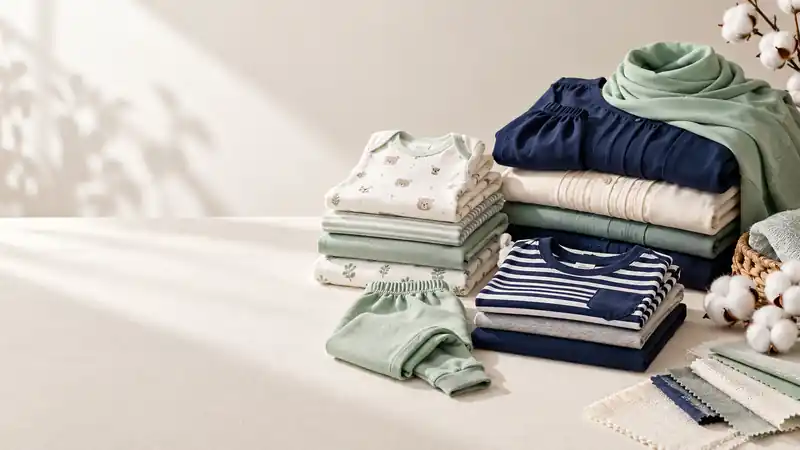](T26-HERO-01.webp) [T26-HERO-01](T26-HERO-01.webp) |  [T26-HERO-02](T26-HERO-02.webp) |  [T26-HERO-03](T26-HERO-03.webp) |

## About Armaghan / درباره ارمغان

تعامل تجاری و دست‌دادن

| گزینه ۱ | گزینه ۲ | گزینه ۳ |
|---|---|---|
|  [T26-ABOUT-01](T26-ABOUT-01.webp) |  [T26-ABOUT-02](T26-ABOUT-02.webp) |  [T26-ABOUT-03](T26-ABOUT-03.webp) |

## Capability — production / توانمندی تولید

کارگاه مفهومی، بازرسی دوخت، چیدمان تولید

| گزینه ۱ | گزینه ۲ | گزینه ۳ |
|---|---|---|
|  [T26-CAP-PRODUCTION-01](T26-CAP-PRODUCTION-01.webp) | [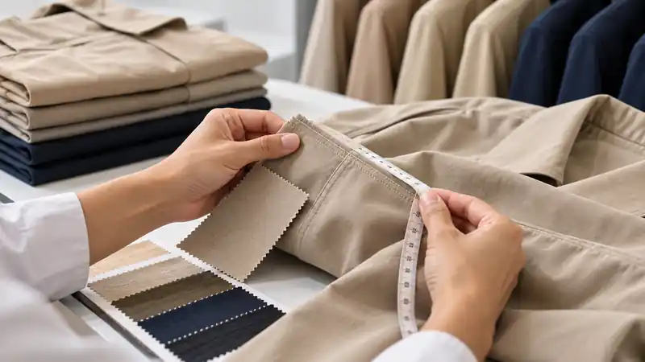](T26-CAP-PRODUCTION-02.webp) [T26-CAP-PRODUCTION-02](T26-CAP-PRODUCTION-02.webp) |  [T26-CAP-PRODUCTION-03](T26-CAP-PRODUCTION-03.webp) |

## Capability — export prep / توانمندی صادرات

بسته‌بندی، آماده‌سازی منظم، صحنه ارسال

| گزینه ۱ | گزینه ۲ | گزینه ۳ |
|---|---|---|
|  [T26-CAP-EXPORT-01](T26-CAP-EXPORT-01.webp) | [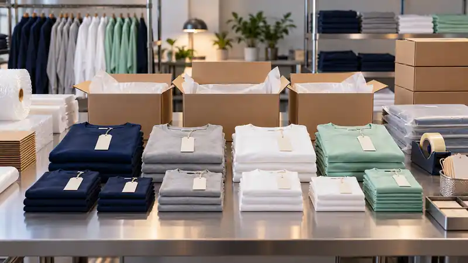](T26-CAP-EXPORT-02.webp) [T26-CAP-EXPORT-02](T26-CAP-EXPORT-02.webp) |  [T26-CAP-EXPORT-03](T26-CAP-EXPORT-03.webp) |

## Capability — trade documents / توانمندی اسناد

پرونده خالی، چک‌لیست خالی، میز تجاری

| گزینه ۱ | گزینه ۲ | گزینه ۳ |
|---|---|---|
| [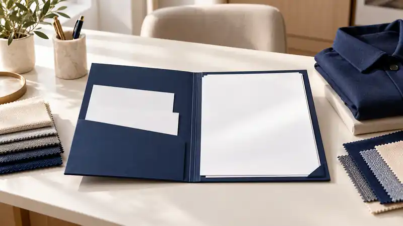](T26-CAP-DOCS-01.webp) [T26-CAP-DOCS-01](T26-CAP-DOCS-01.webp) | [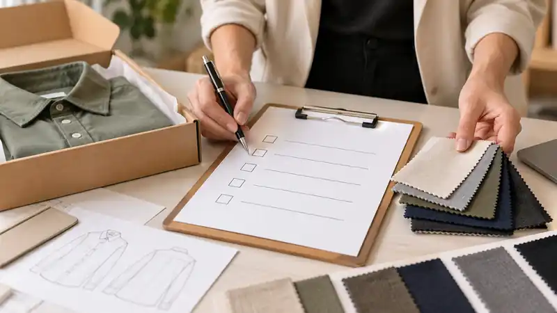](T26-CAP-DOCS-02.webp) [T26-CAP-DOCS-02](T26-CAP-DOCS-02.webp) |  [T26-CAP-DOCS-03](T26-CAP-DOCS-03.webp) |

## Baby banner / بنر نوزادی

ست نوزادی، لباس آویز، چیدمان تخت

| گزینه ۱ | گزینه ۲ | گزینه ۳ |
|---|---|---|
|  [T26-BANNER-BABY-01](T26-BANNER-BABY-01.webp) | [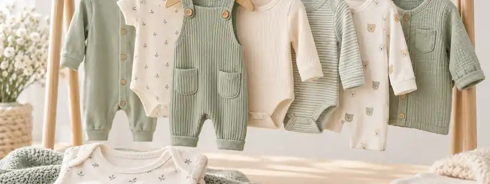](T26-BANNER-BABY-02.webp) [T26-BANNER-BABY-02](T26-BANNER-BABY-02.webp) | [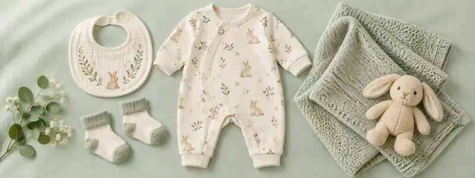](T26-BANNER-BABY-03.webp) [T26-BANNER-BABY-03](T26-BANNER-BABY-03.webp) |

## Kids banner / بنر بچگانه

مانکن کودک، رگال پوشاک، مدل‌های کودک

| گزینه ۱ | گزینه ۲ | گزینه ۳ |
|---|---|---|
| [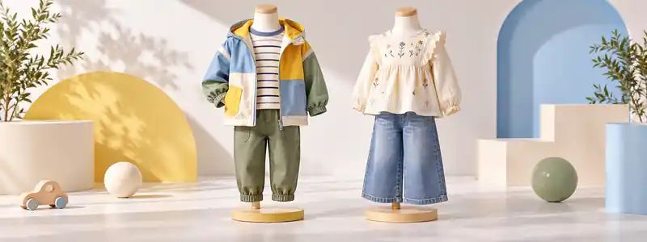](T26-BANNER-KIDS-01.webp) [T26-BANNER-KIDS-01](T26-BANNER-KIDS-01.webp) |  [T26-BANNER-KIDS-02](T26-BANNER-KIDS-02.webp) |  [T26-BANNER-KIDS-03](T26-BANNER-KIDS-03.webp) |

## Women banner / بنر زنانه

پوشاک پوشیده، مانکن پوشاک، مدل‌های محجبه

| گزینه ۱ | گزینه ۲ | گزینه ۳ |
|---|---|---|
|  [T26-BANNER-WOMEN-01](T26-BANNER-WOMEN-01.webp) | [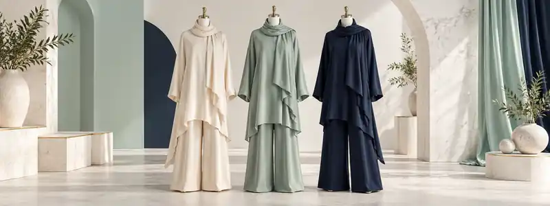](T26-BANNER-WOMEN-02.webp) [T26-BANNER-WOMEN-02](T26-BANNER-WOMEN-02.webp) | [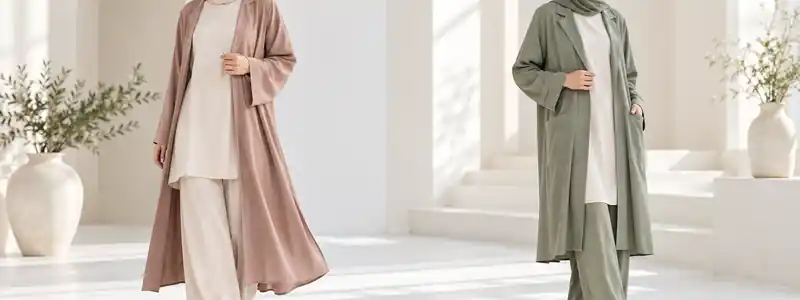](T26-BANNER-WOMEN-03.webp) [T26-BANNER-WOMEN-03](T26-BANNER-WOMEN-03.webp) |

## Products intro optional / پس‌زمینه معرفی محصولات

بافت پارچه، فضای خالی، بافت نزدیک

| گزینه ۱ | گزینه ۲ | گزینه ۳ |
|---|---|---|
|  [T26-PRODUCTS-INTRO-01](T26-PRODUCTS-INTRO-01.webp) |  [T26-PRODUCTS-INTRO-02](T26-PRODUCTS-INTRO-02.webp) | [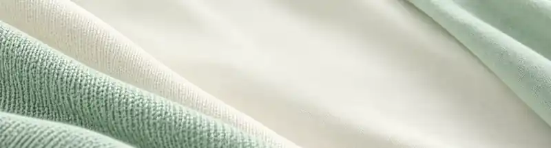](T26-PRODUCTS-INTRO-03.webp) [T26-PRODUCTS-INTRO-03](T26-PRODUCTS-INTRO-03.webp) |

## ضوابط بازبینی

- تصاویر زنانه با پوشش کامل اسلامی و بدون موی نمایان ساخته شده‌اند.
- تصاویر اسناد هیچ مهر، گواهی یا تأییدیه جعلی ندارند.
- عکس‌های کودکان/نوزادان در قالب کالاهای مفهومی و صحنه‌های امن‌اند.
- گزینه‌های Hero و About جایگزین انتخاب‌های مورد تأیید قبلی نیستند؛ فقط گزینه‌های جایگزین‌اند.
